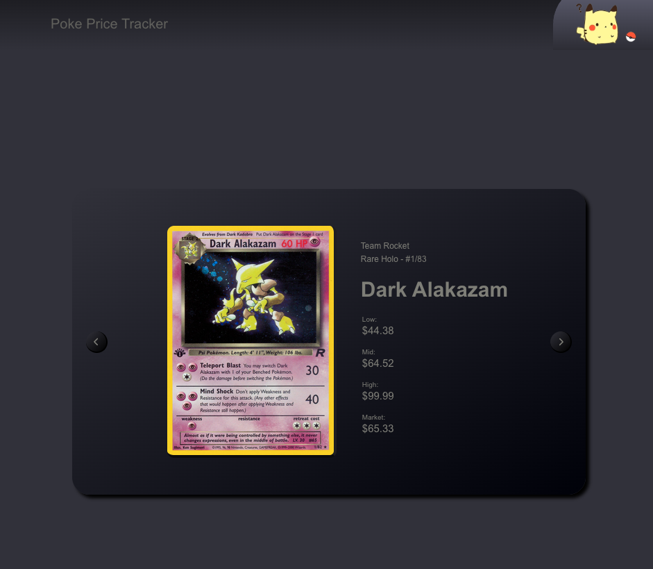

# Poke Price Tracker

### [evrook.github.io/Poke-Price-Tracker](https://evrook.github.io/Poke-Price-Tracker/)

 

## About:
---

    This project is to build out a well known UI pattern in react with data integrated from an API. 

 

## Later Additions:
---
- Integrated data for all sets.
- Modal display for cards
- Filter/Search functionality 

 

## How to get started:
---

- Get Familiar with the [Pokemon TCG API](https://pokemontcg.io/)

- Check out the [Pokemon TCG Documentation](https://docs.pokemontcg.io/)

- Set up loaders in <code>loaders.js</code> to communicate with the API.

    ex:

    export const rocketLoader = async () => {
        const res = await fetch(`https://api.pokemontcg.io/v2/cards?q=id:base5`)

        return res.json()
    }

 

## Built With:
---

 

 

## Acknowledgements:
---

- [Badges4](https://github.com/alexandresanlim/Badges4-README.md-Profile)

- [Pokemon TCG API](https://pokemontcg.io/)

## Contributions
---
- [Source Code](https://github.com/evRook/Poke-Price-Tracker)
- [Issue Tracker](https://github.com/evRook/Poke-Price-Tracker/issues)